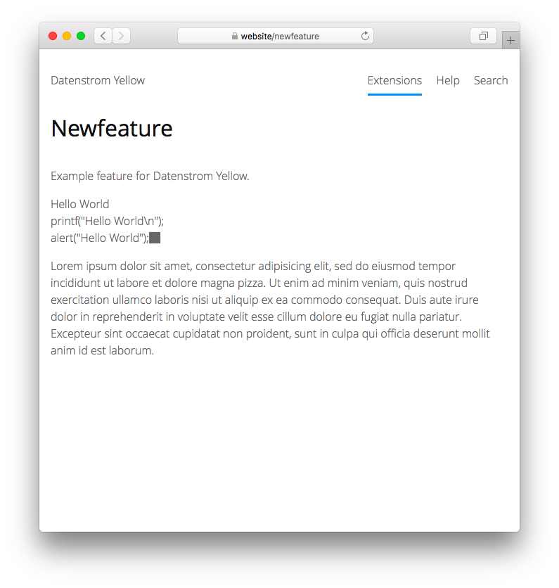

# Newfeature 0.9.1

Example feature for Datenstrom Yellow.

*Tips for developers and designers: You can use this example feature to make an extension for Datenstrom Yellow. Click on "Use this template" at the top of the page. This will create a new repository on GitHub. Edit the README file in your repository, go to "How to install an extension" and change the download link to the URL of your repository. Have fun coding.*

## How to install an extension

[Download ZIP file](https://github.com/datenstrom/yellow-newfeature/archive/refs/heads/main.zip) and copy it into your `system/extensions` folder. [Learn more about extensions](https://github.com/annaesvensson/yellow-update).

## How to make animated text

Create a `[newfeature]` shortcut with an optional text. 

## Examples

Content file with animated text:

    ---
    Title: Example page
    ---
    This is an example page with animated text.

    [newfeature - Hello World]
    [newfeature - printf("Hello World\n");]
    [newfeature - alert("Hello World");]  

    Lorem ipsum dolor sit amet, consectetur adipisicing elit, sed do eiusmod 
    tempor incididunt ut labore et dolore magna pizza. Ut enim ad minim veniam, 
    quis nostrud exercitation ullamco laboris nisi ut aliquip ex ea commodo.

Making animated text:

    [newfeature - We <3 people who code.]
    [newfeature - This is an example text.]
    [newfeature - This is an especially long example text.]  

Making animated text inside a list:

    Datenstrom Yellow is for people who make small websites.
    
    * [newfeature - Fun to use]
    * [newfeature - Installed in a few minutes]
    * [newfeature - Just files and folders]

## Developer

Your name. [Get help](https://datenstrom.se/yellow/help/).
